# ЗНАЧЕНИЕ МОСКОВСКИХ МУЗЫКАЛЬНЫХ ФЕСТИВАЛЕЙ В РОССИЙСКОМ КОНТЕКСТЕ

### *Выполнено Ермишиной Аленой, Орловой Марией, Макаевой Людмилой и Тарасовой Екатериной.*

### В качестве объекта нашего исследования мы выбрали 4 крупных московских музыкальных фестиваля, которые проходят в столице на протяжении нескольких лет: Park Live, Боль, Пикник «Афиши» и Bosco Fresh Fest. 

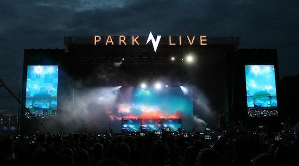 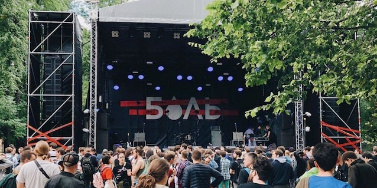 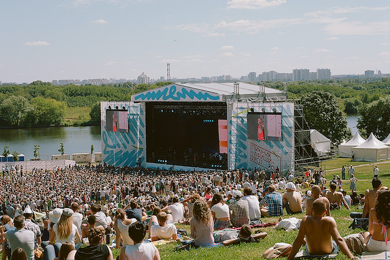 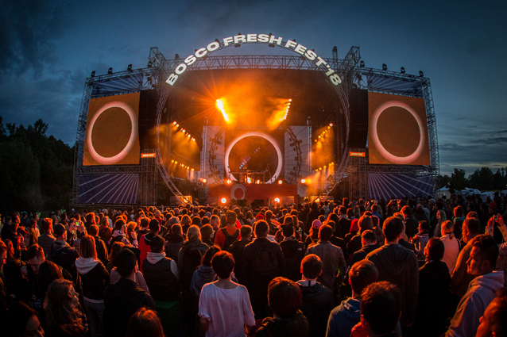 

### **Задачи проекта:**

1. Выяснить значение локальных московских фестивалей для российского музыкального слушателя; 
2. Предложить методику измерения значимости (выявить количество иногородних посетителей);
3. Выявить уровень заинтересованности посетителей в других исследуемых мероприятий (вывести одинаковые ID); 
4. Собрать, структурировать и анализировать социальных (город) и статистических характеристик;
5. Визуализировать полученную информацию;

Первым шагом было вывести количество участников в пабликах Вконтакте каждого фестиваля. 

Park Live | Боль | Пикник "Афиши" | Bosco Fresh Fest
:----     | ----:| :----:         | :----:
 25.946   | 13.259| 16.609        | 15.259

Вторым шагом мы изучили количество участников из каждого города.

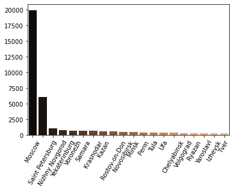 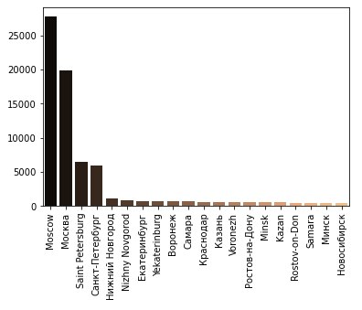 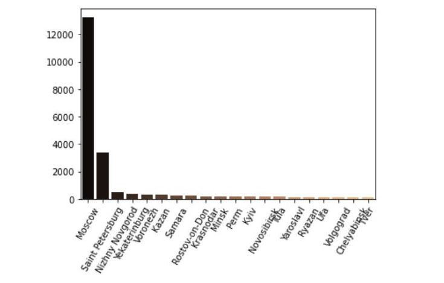 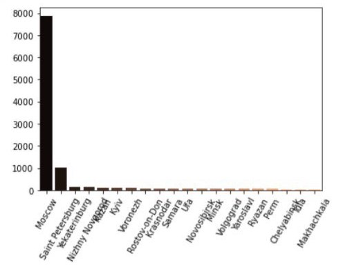

Третьим шагом выявили участников из столиц (Москва и Санкт-Петербург) и других городов.

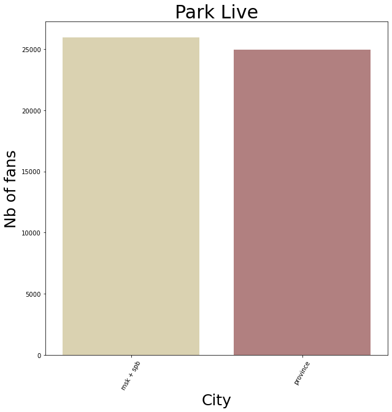 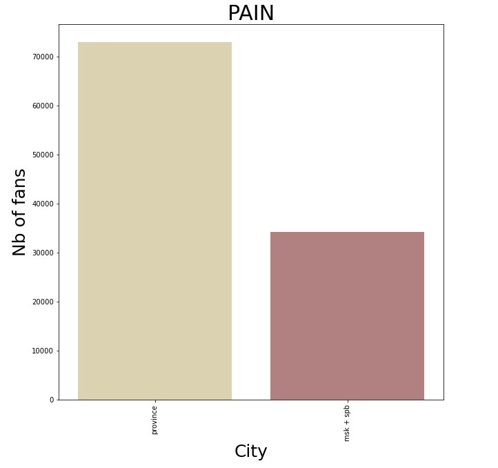 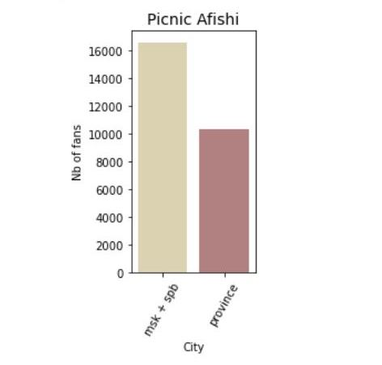 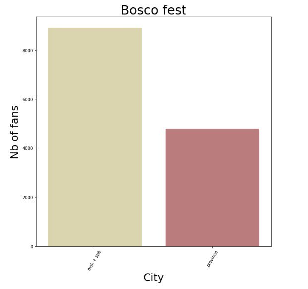

**Выводы:**
