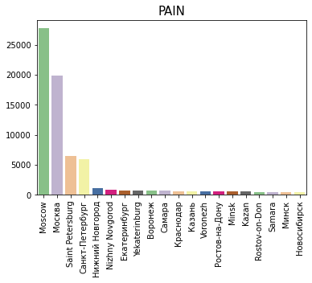

# ЗНАЧЕНИЕ МОСКОВСКИХ МУЗЫКАЛЬНЫХ ФЕСТИВАЛЕЙ В РОССИЙСКОМ КОНТЕКСТЕ

### (*Выполнено Ермишиной Аленой, Орловой Марией, Макаевой Людмилой и Тарасовой Екатериной*)

### В нашем проекте мы исследовали, насколько московские музыкальные фестивали являются значимыми для российской музыкальной сцены.

Для этого мы выбрали четыре разных по форматам и направлениям фестиваля, чтобы в дальнейшем изучить их аудиторию: 

Фестиваль БОЛЬ, 

Bosco Fresh Fest, 

Park Live Festival, 

Пикник «Афиши». 

Мы сознательно выбрали фестивали, которые представляют разные виды музыки, чтобы посмотреть, есть ли в их официальных пабликах общие элементы. 

 

 

 

### **Задачи проекта:**

1. Выяснить значение локальных московских фестивалей для российского музыкального слушателя; 
2. Предложить методику измерения значимости (выявить количество иногородних посетителей);
3. Выявить уровень заинтересованности посетителей в других исследуемых мероприятий (вывести одинаковые ID); 
4. Собрать, структурировать и анализировать социальных (город) и статистических характеристик;
5. Визуализировать полученную информацию;

Park Live | Боль | Пикник "Афиши" | Bosco Fresh Fest
:----     | ----:| :----:         | :----:
 25.946   | 13.259| 16.609        | 15.259

Чтобы выяснить значимость московских фестивалей, мы изучали официальные страницы ВКонтакте, где измерили соотношение подписчиков из регионов и подписчиков из Петербурга и Москвы.

Наибольшая аудитория фестивалей сосредоточена в Москве и Петербурге, что фиксирует слабую заинтересованность данными событиями у «региональных» любителей музыки.

   

   

Отметим, что наибольшее количество «региональной» аудитории у фестиваля Park Live. 

Однако мы вычислили, что подписчики страницы Park Live слабо интересуются тремя другими фестивалями, поэтому предлагаем посмотреть на пересечение подписчиков Bosco Fresh Fest, БОЛЬ и Пикник «Афиши».

Среди подписчиков четырех страниц мы выявили всего 18 меломанов: именно столько людей следят за информацией одновременно четырех фестивалей.

Нам было важно узнать информационный и музыкальный контексты, в которых существуют фестивали. Для этого мы узнали, насколько похожим является наполнение страниц: мы искали общие упоминания мест и музыкальных исполнителей. Вычисления показали, что общих для четырех фестивалей элементов крайне мало. Мы также не обнаружили количественно значимых пересечений информационных  элементов для объединения «Bosco-БОЛЬ-Пикник».

В ходе нашего исследования мы пришли к следующим выводам:

Московские музыкальные фестивали не обладают ярко выраженной значительностью для общероссийского музыкальной жизни. Несмотря на популярность фестивалей в столицах, для жителей регионов они не являются предметом особого интереса. Исключением можно считать фестиваль Park Live, который в равной мере пользуется любовью среди столичных и нестоличных слушателей. На основе полученных данных мы можем предположить, что, теряя популярность у столичных слушателей, фестиваль завоевывает больше аудитории из регионов.
 

Хотим отметить то, что аудитория Park Live не заинтересована в трех других музыкальных фестивалях и закрепляет за собой обособленное место, в то время как посетители Bosco Fresh Fest, БОЛЬ, Пикник «Афиши» следят за страницами сразу нескольких фестивалей.

Несовпадение информационных элементов на страницах ВК показало, что фестиваль БОЛЬ, Bosco Fresh Fest, Park Live Festival, Пикник «Афиши» находятся в разных информационных и музыкальных контекстах. 

